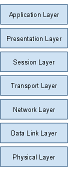
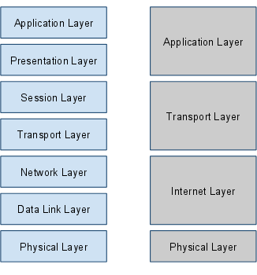

# OSI
- OSI는 시스템간의 연결을 위해 ISO에서 제안한 모델
- 프로토콜을 기능별로 나눈것이다.
- 각 계층은 하위 계층의 기능만을 이용, 상위 계층에게 기능을 제공한다.
 
### OSI 7계층

  
- **응용** : 사용자가 네트워크에 접근할 수 있도록 서비스 제공
- **표현** : 세션 계층 간의 주고받는 인터페이스를 일관성있게 제공
- **세션** : 통신 시스템 사용자간의 연결을 유지 및 설정
- **전송** : 두 host 시스템으로부터 발생하는 데이터 흐름 제공
- **네트워크** : 패킷을 네트워크 간의 IP를 통해 데이터 전달 (라우팅)
- **데이터링크** : 송/수신확인. MAC 주소로 통신 (브릿지, 스위치)
- **물리** : 전송하는데 필요한 기능을 제공 (통신 케이블, 허브)
  
### TCP/IP 4계층 

  
- Application Layer
   - 네트워크를 사용하는 응용프로그램(FTP, Telnet, SMTP) 등으로 이루어지며,  OSI 계층의 Application Layer와 Presentaion Layer를 모두 포함한다.
- Transport Layer
   - 데이터 전송을 위한 계층
   - OSI 모델의 Session Layer, Transport Layer를 포함한다.
   - TCP 프로토콜을 이용해 데이터를 전송한다.
- Internet Layer
   - 데이터 정의, 데이터 경로를 배정하는 일(라우팅)을 담당한다.
   - OSI 모델의 Network Layer, Data Link Layer를 포함한다.
   - IP프로토콜을 사용한다.
- Physical Layer
   - 물리적 계층, 이더넷 카드와 같은 하드웨어를 말한다.
